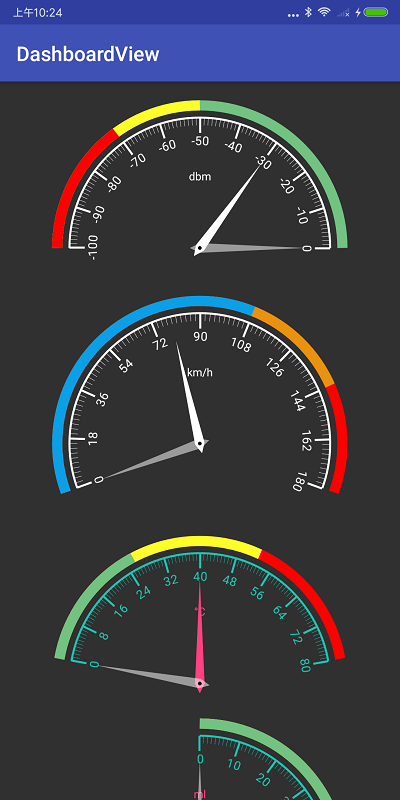
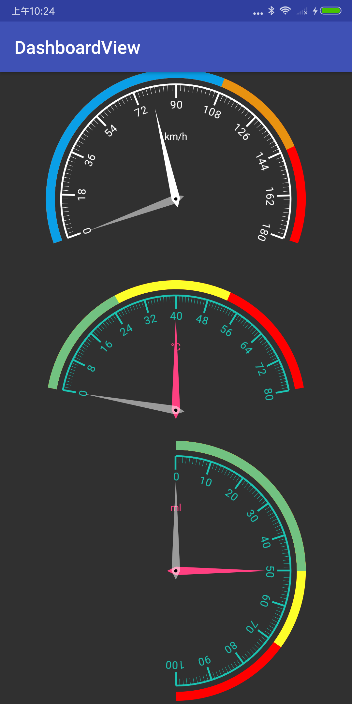

# DashboardView

This is an Android dashboard View, like a mechanical dashboard such as a car. Support many custom styles.

## Preview

## Using DashboardView in your application
### ADT	
	No more support

### Gradle ​ 
Add dependencies in build.gradle of your module:  

	dependencies {
		compile 'com.ayst.view:dashboardview:1.4.3'
	}

## Usage
### Simple Example
	public class MainActivity extends AppCompatActivity {
	
	    private DashboardView mDashboardView;
	
	    @Override
	    protected void onCreate(Bundle savedInstanceState) {
	        super.onCreate(savedInstanceState);
	        setContentView(R.layout.activity_main);
	
	        mDashboardView = (DashboardView) findViewById(R.id.dashboardview_1);
	        mDashboardView.setValue(50); // Set value
	        mDashboardView.resetValue(50); // Set value and clear maximum and minimum
	    }
	}

### XML Usage
If you decide to use DashboardView as a view, you can define it in your xml layouts like this:
 
	<com.ayst.view.DashboardView
        android:id="@+id/dashboardview_1"
        android:layout_width="300dp"
        android:layout_height="wrap_content"
        app:dbv_firstColor="@color/red"
        app:dbv_secondColor="@color/yellow"
        app:dbv_threeColor="@color/green"
        app:dbv_max="0"
        app:dbv_min="-100"
        app:dbv_section="10"
        app:dbv_portion="10"
        app:dbv_lineWidth="2dp"
        app:dbv_colorWidth="10dp"
        app:dbv_colorPadding="10dp"
        app:dbv_longScaleLength="15dp"
        app:dbv_shortScaleLength="10dp"
        app:dbv_startAngle="180"
        app:dbv_sweepAngle="180"
        app:dbv_value="-30"
        app:dbv_showValueText="false"
        app:dbv_showPointerRange="true"
        app:dbv_firstRange="30"
        app:dbv_secondRange="20"
        app:dbv_headerText="dbm"
        app:dbv_headerTextColor="@color/white"
        app:dbv_pointerColor="@color/white"
        app:dbv_minPointerColor="@color/white_30"
        app:dbv_maxPointerColor="@color/white_30"
        app:dbv_scaleColor="@color/white"
        app:dbv_scaleTextSize="12sp"
        />

NOTE:  

* `dbv_firstColor` - First range color
* `dbv_secondColor` - Second range color
* `dbv_threeColor` - Three range color
* `dbv_max` - Max value
* `dbv_min` - Min value
* `dbv_section` - Value range (mMax-mMin) equal parts
* `dbv_portion` - One section equal parts
* `dbv_lineWidth` - Line stroke width
* `dbv_colorWidth` - Color progress stroke width
* `dbv_colorPadding` - Color progress padding
* `dbv_longScaleLength` - Length of long scale
* `dbv_shortScaleLength` - Length of short scale
* `dbv_startAngle` - Starting angle, 0 degrees at 3 o'clock
* `dbv_sweepAngle` - Draw the angle, the difference from the start angle to the end
* `dbv_value` - Value
* `dbv_showValueText` - Whether to display value text
* `dbv_showPointerRange` - Whether to display pointer range
* `dbv_firstRange` - This is a percentage, starting with the minimum value, showing first color within this percentage
* `dbv_secondRange` - This is a percentage, starting with the first range, showing second color within this percentage
* `dbv_headerText` - The header text
* `dbv_headerTextColor` - Header text color
* `dbv_pointerColor` - Pointer color
* `dbv_minPointerColor` - Min Pointer color
* `dbv_maxPointerColor` - Max Pointer color
* `dbv_scaleColor` - Scale color
* `dbv_scaleTextSize` - Scale text size

## Developed By
* E-Mail: ayst.shen@foxmail.com
* WeChat: ayst_shen

## License
	Copyright(c) 2018 Habo Shen <ayst.shen@foxmail.com>

	Licensed under the Apache License, Version 2.0 (the "License");
	you may not use this file except in compliance with the License.
	You may obtain a copy of the License at

	http://www.apache.org/licenses/LICENSE-2.0

	Unless required by applicable law or agreed to in writing, software
	distributed under the License is distributed on an "AS IS" BASIS,
	WITHOUT WARRANTIES OR CONDITIONS OF ANY KIND, either express or implied.
	See the License for the specific language governing permissions and
	limitations under the License.